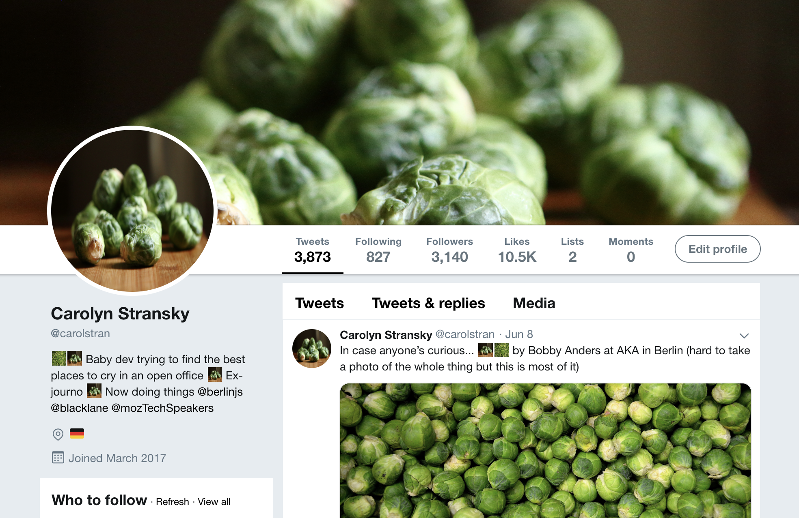

# Seeing Sprouts

_A browser extension that uses the [WebExtensions API](https://developer.mozilla.org/en-US/docs/Mozilla/Add-ons/WebExtensions) to replace all images on a web page with brussels sprouts photos._

## Credits

📷 Photos used came from [Unsplash](https://unsplash.com/), [Pexels](https://www.pexels.com/) and [Pixabay](https://pixabay.com/). You can find the artists in the name of the file.

💡 Inspiration for this extension came from [pikachu-everywhere](https://github.com/shahednasser/pikachu-everywhere/) and [puglife](https://github.com/tiaanduplessis/puglife).

👩‍🎨 Icon was created using [make 8-bit art](https://make8bitart.com/) and based on [Sprout to be Brussels](https://sprouttobebrussels.be).