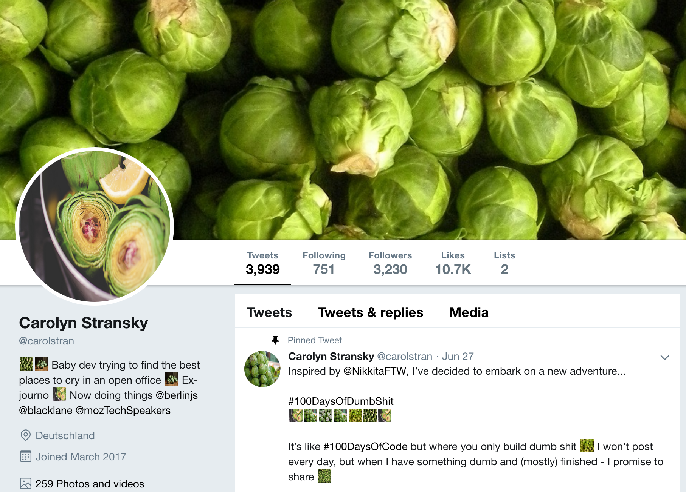

# Seeing Sprouts

_A browser extension that uses the [WebExtensions API](https://developer.mozilla.org/en-US/docs/Mozilla/Add-ons/WebExtensions) to replace all images on a web page with brussels sprouts photos._



## Supported Browsers

Working version is built as a [Firefox add-on](https://addons.mozilla.org/en-US/firefox/addon/seeing-sprouts/) 🦊

## Supported Veggies

This project was initially created to celebrate the sprout. But now, [thanks to the community](https://github.com/carolstran/seeing-sprouts/graphs/contributors), there's support for more vegetables, nutrient-dense fruits and other veggie-like things people enjoy.

- 🌳 [Brussels sprouts](images/screenshots/tweet-sprouts.png) (default)
- 🥑 [Avocados](images/screenshots/tweet-avocados.png)
- 🥦 [Broccoli](images/screenshots/tweet-broccoli.png)
- 🌽 [Corn](images/screenshots/tweet-corn.png)
- 👻 [Candy corn](images/screenshots/tweet-candycorn.png)
- 🍆 [Eggplants](images/screenshots/tweet-eggplants.png)
- 🥔 [Potatoes](images/screenshots/tweet-potatoes.png)
- 🍅 [Tomatoes](images/screenshots/tweet-tomatoes.png)

## Contributing

> ⚠️ This project has a [Code of Conduct](./CODE_OF_CONDUCT.md) that _all_ contributors are expected to follow.

The best way to get involved is by adding a new veggie for the extension to support.

Here are the steps you need to follow: 

### Add your veggie photos to the [`images`](./images) directory

**1. Create a new directory within [`images`](./images) named after your veggie.**

If the name of the veggie is more than one word, please use the camelCase naming convention.

**2. Fill this directory with JPG images of your veggie.**

Some suggestions of where to find images: [Unsplash](https://unsplash.com/), [Pexels](https://www.pexels.com/) and [Pixabay](https://pixabay.com/). The images must be available for public use without credit.

For the individual image file names, please use the following convention:

```
[ARTIST_NAME]-[SITE].jpg
```

### Write some code so the extension recognizes your veggie

> Note: All lists are in alphabetical order (except sprouts because they're the best). 

**1. Modify [`sproutify.js`](./sproutify.js) to include your veggie.**

You'll need to declare a new `const` variable called `yourVeggieImagePaths`. This should be an array of strings containing the paths to the images:

```javascript
// Example of the candy corn image paths
const candyCornImagePaths = [
  "images/candyCorn/dane-deaner-unsplash.jpg",
  "images/candyCorn/sheri-silver-unsplash.jpg",
  "images/candyCorn/skeeze-pixabay.jpg",
  "images/candyCorn/wokandapix-pixabay.jpg"
];
```

Then, add your variable to the `map`:

```javascript
const map = {
  sprouts: sproutImagePaths,
  avocados: avocadoImagePaths,
  // other veggies
  yourVeggie: yourVeggieImagePaths
};
```

**2. Finally, add a new `option` tag to the dropdown in [`veggie-selector/options.html`](./veggie-selector/options.html) for your veggie.**

Make to set the `value` attribute as the name of your veggie. The tag content should be an emoji (please use the [decimal code](https://www.getemojis.net/html/)) and your veggie's name in lowercase.

```html
<!-- Example of the corn option -->
<option value="corn" class="option">&#127805; corn</option>
```

### 🚀 Ship your veggie

Once all of the above is done, [open a pull request](https://docs.github.com/en/github/collaborating-with-issues-and-pull-requests/creating-a-pull-request) 💖

## Credits

📷 Photos used came from [Unsplash](https://unsplash.com/), [Pexels](https://www.pexels.com/) and [Pixabay](https://pixabay.com/). You can find the artists in the name of the file.

💡 Inspiration for this extension came from [pikachu-everywhere](https://github.com/shahednasser/pikachu-everywhere/) and [puglife](https://github.com/tiaanduplessis/puglife).

👩‍🎨 Icon was created using [make 8-bit art](https://make8bitart.com/) and based on [Sprout to be Brussels](https://sprouttobebrussels.be).

## Show your support

If you like this extension, please consider buying me a coffee so that I can continue to make wholesome things!

[](https://ko-fi.com/L4L41MXHP)